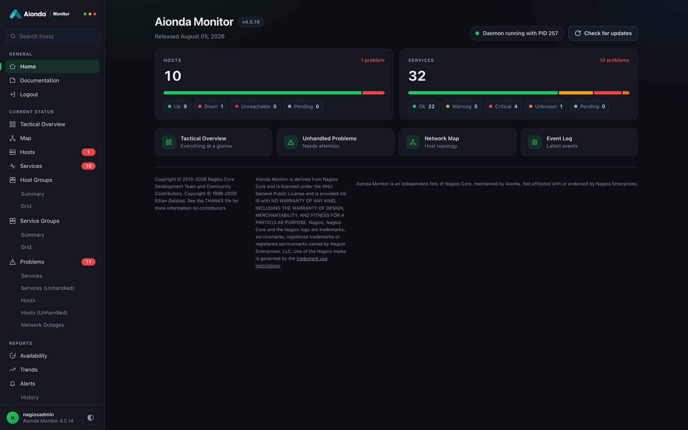
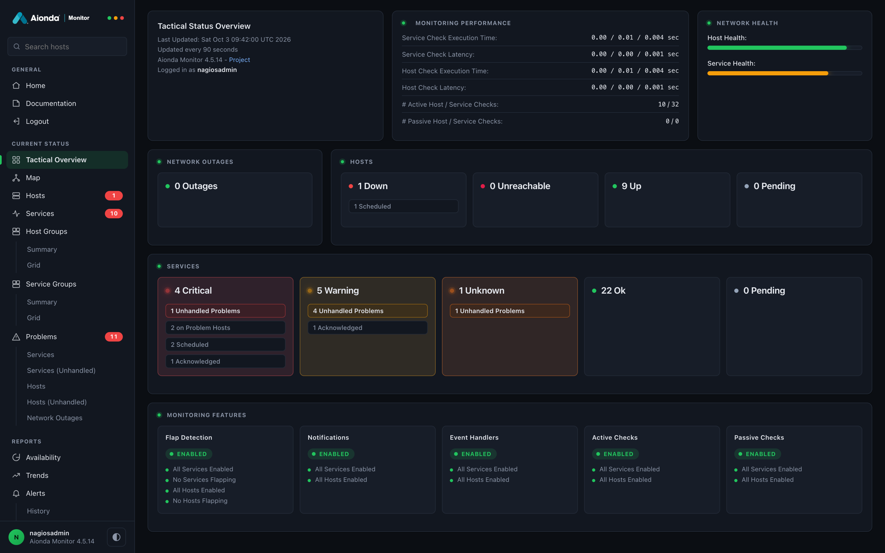
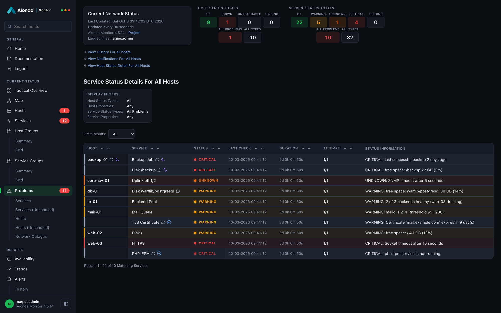
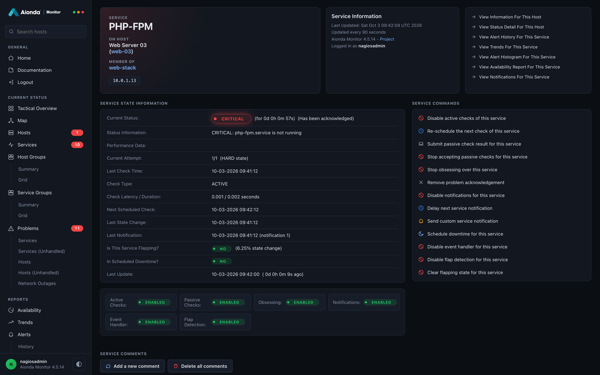
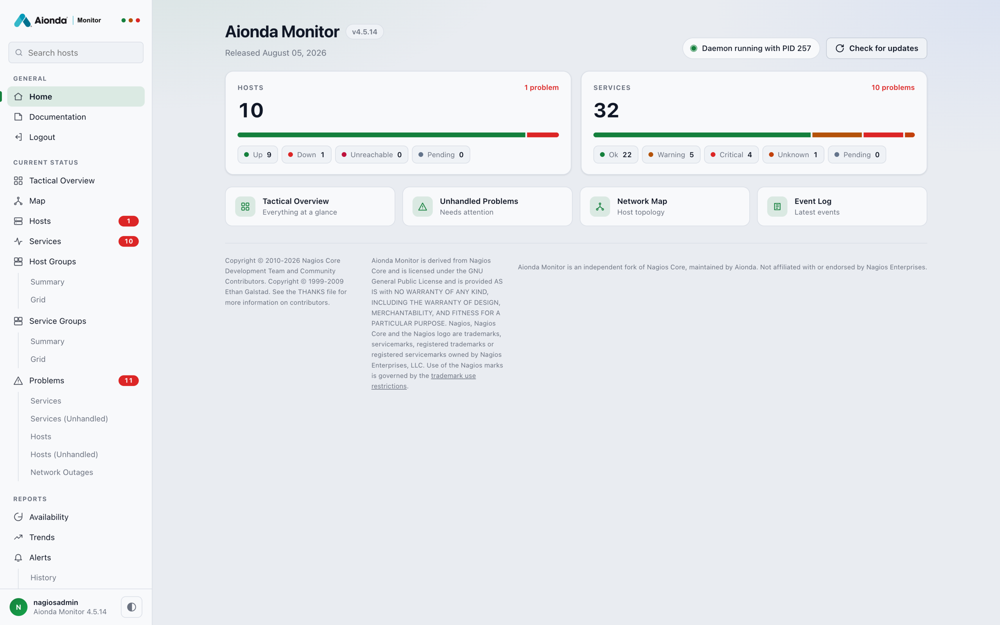
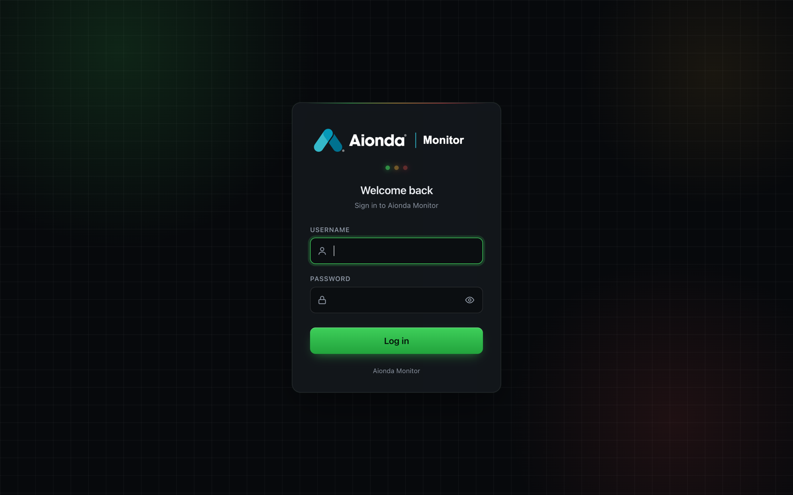
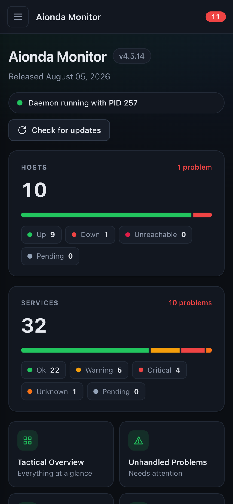
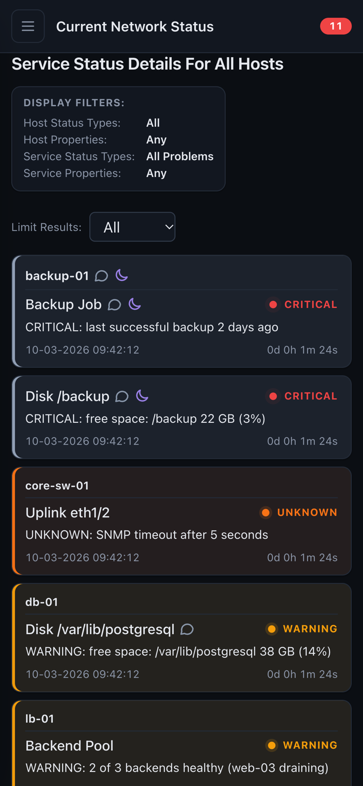

# Aionda Monitor


**Straightforward infrastructure monitoring with a built-in MCP server for AI assistants.**

Aionda Monitor is an independent fork of [Nagios Core](https://github.com/NagiosEnterprises/nagioscore),
maintained by Aionda. It is derived from Nagios Core 4.5.14 and retains the upstream
Git history and attribution. It is not affiliated with, sponsored by, or endorsed
by Nagios Enterprises.

## What this project adds

- A redesigned web interface with light and dark themes and mobile navigation.
- Form-based login compatible with password managers.
- A native MCP server for monitoring queries, operational actions, and validated
  configuration changes with backups.
- Built-in MCP help so AI assistants can discover workflows without reading source code.
- A monitoring-focused home page without promotional banners or page tours.

## Screenshots

All screenshots show demo data.



| | |
|---|---|
|  |  |
| **Tactical overview** | **Service problems** |
|  |  |
| **Service details** | **Light theme** |
|  |   |
| **Form login** | **Mobile** |

The project keeps the existing monitoring engine, plugin interface, and object
configuration format. The main configuration file is `monitor.cfg`; an existing
`nagios.cfg` in the same directory is still used when `monitor.cfg` is missing.
Compatibility names such as the `nagios` executable, service accounts, and
existing installation paths remain in place.
The inherited 4.5.14 version currently identifies the upstream baseline.

## Build and test

On Linux, install a C toolchain and the dependencies described in
[the CI workflow](.github/workflows/test.yml), then:

```sh
./configure --enable-testing
make all
make test
```

Read [CLAUDE.md](CLAUDE.md) for architecture, build targets, and development guidance.
Do not run `make install-config` over an existing production configuration.

## AI integration

The MCP endpoint uses authenticated Streamable HTTP. Tokens have scoped
permissions; configuration edits are planned, validated, backed up, and applied
explicitly. See [the MCP guide](docs/mcp-server.md).

## Documentation and support

- [Project issues](https://github.com/AiondaDotCom/aionda-monitor/issues)
- [MCP server](docs/mcp-server.md)
- [Web interface](docs/webui-redesign.md)
- [Upstream history](Changelog)
- [Origin and licensing](FORK.md)

Use this repository for Aionda Monitor issues, not the upstream Nagios support channels.
This repository contains the product source, not production credentials or monitoring data.

## License and attribution

Aionda Monitor is distributed under the **GNU General Public License, version 2**;
see [LICENSE](LICENSE). Existing file-specific and third-party license notices remain
applicable. Original copyrights and contributor acknowledgments are preserved.

Nagios and the Nagios logo are trademarks of Nagios Enterprises. References to Nagios
describe the project's origin and compatibility; they do not imply endorsement.
